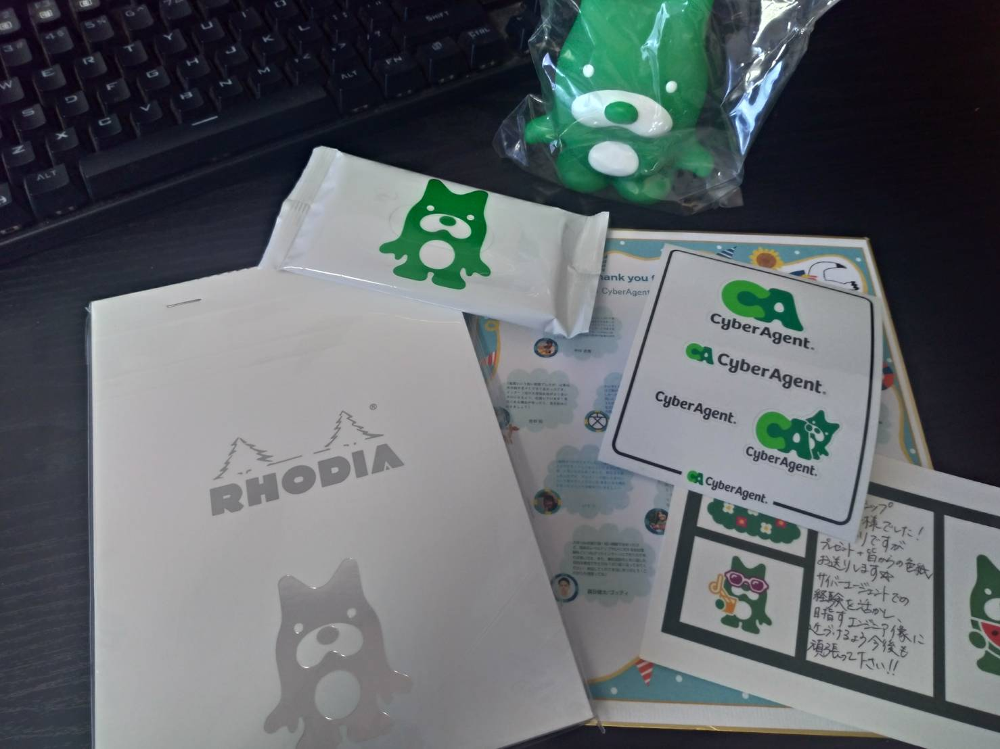
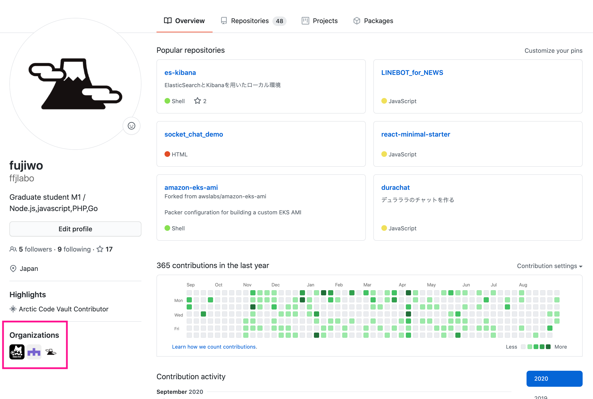

どうもふじをです。

今回はサイバーエージェントの 7days インターンに参加してきたのでその時のお話を備忘録として残そうかと思います。

## インターン概要

今回参加したインターンは**7days サーバーサイド向け 体験就業型インターンシップ CA Tech Job Lite**というインターンです。

[CA Tech Job Lite](https://www.cyberagent.co.jp/careers/students/event/detail/id=24424)

> 「1 ヶ月まるごとだと時間が取りづらい」「ハードルが高そう」といった学生の皆様からの声を受け、より気軽に実務を体験することができるよう、『CA Tech JOB Lite』として新しい就業型インターンシップを開催します。

こんな感じのコンセプトです。さらに今回はコロナ禍だったのでオンラインでのインターンとなりました。

就業型インターンなので、あらかじめ人事やエンジニアの方々と面談し、配属部署を決定しました。僕は大規模サービスの開発を経験してみたい、特に AbemaTV の裏側ってどうなってるんだろうという興味があったのでそれを相談させていただき、AbemaTV に配属されることになりました。

## 何をやったか

配属先は AbemaTV 開発本部のプロダクト開発チームに配属されました。この部署は、主にユーザー側・管理側両方の API などを担当するチームです。

今回は 1 週間という短い期間だったので**AbemaTV の開発フローを体験する**ことを目的として、小さめのタスクをいくつかいただき、リリースまでの一連の流れを体験するといった感じです。タスク内容としては、テストコードのリファクタリングだったり、既存機能の修正を担当させていただきました。

実はこのインターンに参加するまでに、テストコードを書いたことがない、マイクロサービスに携わったことがないという状態でした。そんな状態だったので軽めのタスクをいただいたにも関わらずかなり苦戦してました。しかし、メンターの方含めチームの方々が親切に説明してくださったおかげで知識を吸収しながら作業することができました。ほんとに感謝です。

リリースまで一通りやらせて頂いて感じたのは、大規模サービスにも関わらずデプロイが簡単だったことです。当初の予想だと、AbemaTV のような大規模サービスってデプロイまでにかなり複雑なことするんじゃないかと思ってました。が、実際はそんなことは全くなくて、コード修正後は github でマージして、slack bot を使って本番適応するという形でした。めっちゃ簡単で「え、これでもう適用されちゃうの？」という感じです。個人的に開発者の Developer Experience の向上にも興味があったので非常にいい経験をさせていただきました。

あと、インターン期間中に開催された社内カンファレンスにも参加させていただきました。このカンファレンスは１日中開催されてたんですが、まさかの全セッション参加しておっけーとのことでびっくりしました。もう思う存分聞きたいセッションを回って勉強させていただきました。会場がとっても面白くて、カンファレンスは「cluster」というバーチャル SNS を利用し、バーチャル空間上で開催するといった形でした。詳しくは以下の記事を見るとわかりやすいかと思います！

[「リアルタイム 3DCG 合成」に「バーチャル会場の設営」 今だからチャレンジできた、NewNormal なカンファレンス](https://www.cyberagent.co.jp/way/features/list/detail/id=25194)

## インターンの雰囲気

今回はオンラインでのインターンだったのでどんな感じで進んでいくのかかなり不安に感じてましたが、ちゃんと質問がある時は Zoom や slack で反応していただいてかなり快適でした。レスポンスめちゃ早です。

特に slack で分報を初めてやったのですが、これがなかなかよかったです。分報では、個人の作業状況はもちろんのこと、その時のお気持ちなどなんでも投稿してよいチャンネルです。要は Twitter のように使っていいチャンネルです。ここに「〇〇で詰まってる…」みたいな投稿をするとどこからともなく社員の方からアドバイスが飛んできます。おかげで心理的障壁はかなり少なかったです。テキスト上でわからなければ、適宜 Zoom で相談もできました。

また、チームの方々とランチさせていただいたり、チームの 20 卒の方々がオンライン飲み会を開いてくださったりなど社員の方々との交流も多くさせていただきました。社員の方々はとても気さくで、就活の相談乗っていただいたり、会社のことを色々お聞きしたりしてすごくためになったし楽しかったです！

## 終わりに

インターンでは自分が予想していた以上にコードが読めない書けないでした。それはもう非常に悔しかったです。しかしながら、インターン期間中にその原因が具体的に洗い出せたので、これから精進していこうと思います。

​

**インターン後にいただいたノベルティたち**

​

**organization に join した時に記念の一枚**

